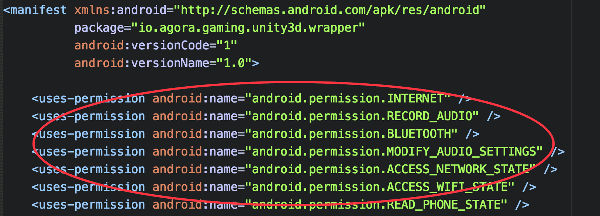

# Basic: Implementing Voice for Gaming

## Step 1: Prepare the Environment

1.  [Download](https://docs.agora.io/en/2.1.1/download)**Unity** Voice. See the following structure:

      


-   *include:* header files. Typically not used in Unity3D projects except for modifying raw data.

-   *libs:* library files. Only the *.jar* and *.so* files and the C\# API library files encapsulated in the *Scripts* folder are used on this page.

-   *samples:* sample code


1.  Hardware and software requirements:

    -   Unity3D 5.5 or later

    -   Android Studio 2.0 or later

    -   Two or more Android 4.0 or later devices with audio support

2.  app\_id\_en


## Step 2: Create a New Project

Create a Unity3D project. Refer to [here](https://developer.apple.com/library/content/documentation/IDEs/Conceptual/AppStoreDistributionTutorial/Setup/Setup.html)

## Step 3: Add the SDK

1.  Open the root directory of the project and create:

    -   *Plugins/Android/AgoraAudioKit.plugin/libs*

    -   *Plugins/Scripts*

2.  Copy the *libs/Scripts/AgoraGamingSDK* folder to *Plugins/Scripts*.

3.  Add *.jar* files:

    -   Copy *.jar* files to *Assets/Plugins/Android/AgoraAudioKit.plugin/libs*.

    -   Copy *Hello-Unity3D-Agora/Assets/Plugins/Android/mainTemplate.gradle* to Assets/Plugins/Android.

    -   Copy *Hello-Unity3D-Agora/Assets/Plugins/Android/AgoraAudioKit.plugin/libs/libagora-unity3d-wrapper.jar* to *Assets/Plugins/Android/AgoraAudioKit.plugin/libs*.

    -   Copy *Hello-Unity3D-Agora/Assets/Plugins/Android/AgoraGamingRtcSDKWrapper/AndroidManifest.xml* to *Assets/Plugins/Android/AgoraAudioKit.plugin*.

    **Note:** 

    *libagora-unity3d-wrapper.jar* is compiled from *Hello-Unity3D-Agora/Assets/Plugins/Android/AgoraGamingRtcSDKWrapper* \(

    ```
    ./gradlew clean makeAndCopySDKWrapper
    ```

    \).

4.  Add *.so* files:

    Copy *arm64-v8a/armeabi-v7a/x86* from *libs/Android* to *Assets/Plugins/Android/AgoraAudioKit.plugin/libs*.


## Step 4: Add Permissions

Add any necessary permission to *AndroidManifest.xml*. *AgoraGamingRtcSDKWrapper* already includes the required permissions for voice calls, for example:

-   android.permission.INTERNET

-   android.permission.RECORD\_AUDIO

-   android.permission.MODIFY\_AUDIO\_SETTINGS

-   android.permission.ACCESS\_NETWORK\_STATE

-   android.permission.BLUETOOTH


  

## Step 5: Obfuscate the Code

Add the following line to obfuscate the code:

```
-keep class io.agora.**{*;}
```

## Step 6: Call the APIs

Call the APIs in [Interactive Gaming API](../API%20Reference/game_unity.html) to implement the required functions. Voice for gaming includes two modes:

-   Free talk mode

-   Command mode


You can choose which mode to use by calling [Set the Channel Profile \(SetChannelProfile\)](../API%20Reference/game_unity.html#).

