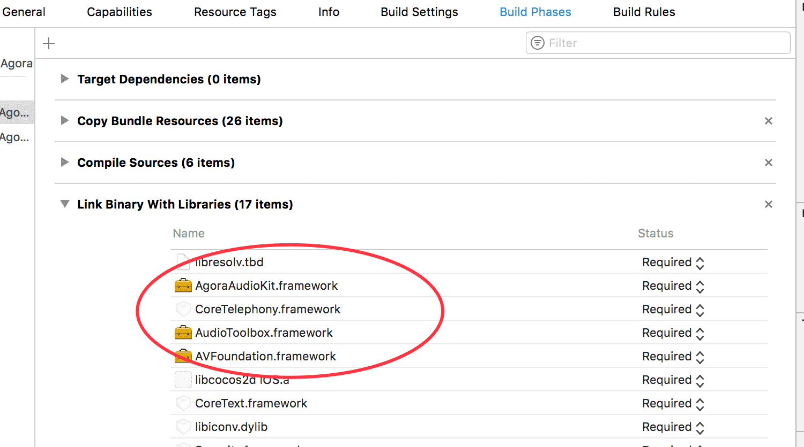

# Basic: Implementing Voice for Gaming

## Step 1: Prepare the Environment

1.  [Download](https://docs.agora.io/en/2.1.1/download)**Unity** Voice. See the following structure:

      

-   *include:* header files. Typically not used in Unity3D projects except for when modifying the raw data.

-   *libs:* library files. Only the framework files and C\# API library files encapsulated in the in the *Scripts* folder are used in this document.

-   *samples:* sample code

1.  Hardware and software requirements:

    -   Unity3D 5.5 or later

    -   Xcode 8.0 or later

    -   Two or more iOS 9.0 or later devices with audio support

2.  app\_id\_en

## Step 2: Create a New Project

Create a Unity3D project. Refer to [here](https://developer.apple.com/library/content/documentation/IDEs/Conceptual/AppStoreDistributionTutorial/Setup/Setup.html)

## Step 3: Add the SDK

1.  Open the root directory of the project and create the following:

    -   *Plugins/Android/AgoraAudioKit.plugin/libs*

    -   *Plugins/Scripts*

2.  Copy the *libs/Scripts/AgoraGamingSDK* folder to *Plugins/Scripts*.

3.  Add *.framework* files:

    -   Copy *AgoraAudioKit.framework* to *Plugins/iOS*.

    -   Copy *Hello-Unity3D-Agora/Assets/Plugins/iOS/AgoraGamingRtcSDKWrapper.h* to *Plugins/iOS*.

    -   Copy *Hello-Unity3D-Agora/Assets/Plugins/iOS/AgoraGamingRtcSDKWrapper.mm* to *Plugins/iOS*.

    -   Add the necessary system libraries:

      

## Step 4: Disable *bitcode*

1.  Select the current *Target*.

2.  Select *Build Settings*.

3.  Select *Enable Bitcode*，and set it to *No*.

  

## Step 5: Add Permissions

Add any necessary permission, such as access permission to the microphone:

  

## Step 6: Call the APIs

Call the APIs in [Interactive Gaming API](../API%20Reference/game_unity.html) to implement the required functions. Voice for gaming includes two modes:

-   Free talk mode

-   Command mode

You can choose which mode to use by calling [Set the Channel Profile \(SetChannelProfile\)](../API%20Reference/game_unity.html#).

