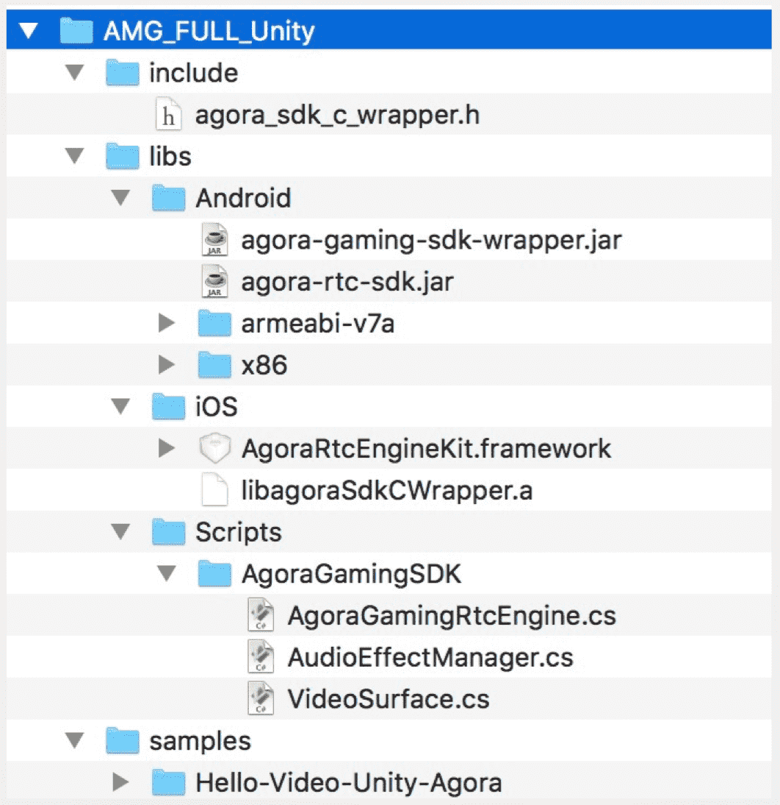
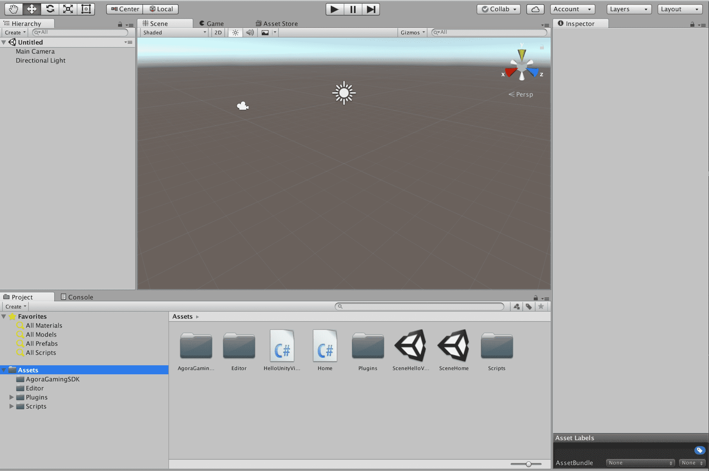
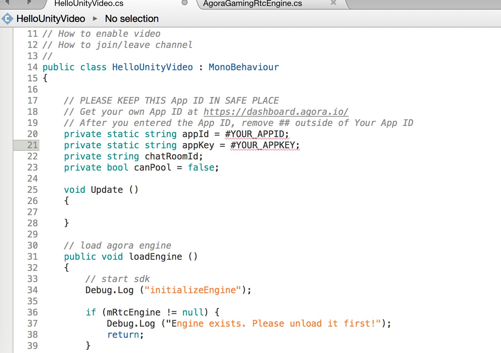
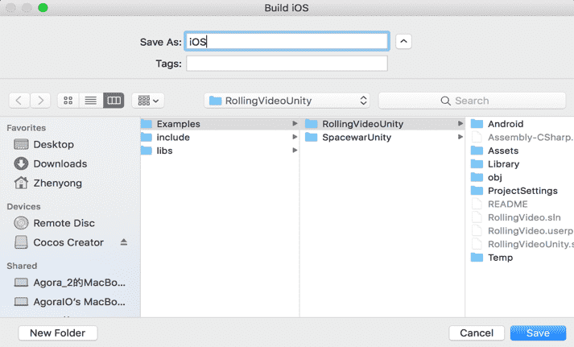
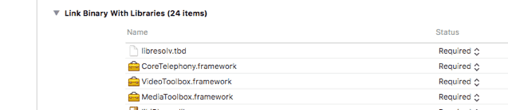
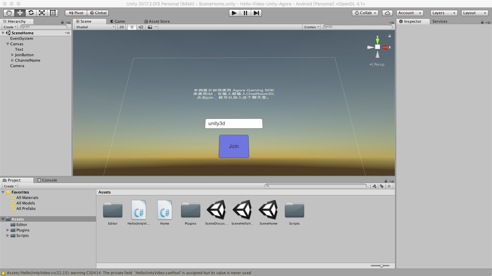
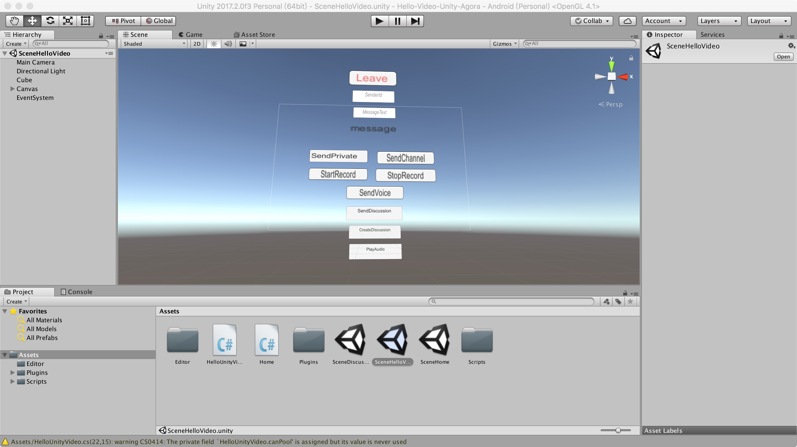

# Basic: Implementing IM for Gaming

With *Hello-IM-Unity-Agora* Demo, you can implement the following functions:

-   Send / receive point-to-point messages

-   Send / receive chatroom messages

-   Send / receive discussion messages

-   Send / receive voice messages

## Step 1: Prepare the Environment

1.  [Download](https://www.agora.io/en/blog/download/)

      

2.  Hardware and software requirements:

    -   Unity 5.5 or later

    -   Xcode 8.0 or later

    -   Two or more iOS 9.0 or later devices with video and audio functions

    -   Get an App ID. See [Getting an App ID](http://test-portal.agora.io/en/IM_private/product/Interactive%20Gaming/Agora%20Basics/key_native#app-id-native#)

    -   Get an App Key. Contact [sales@agora.io](mailto:sales@agora.io) for your App Key

## Step 2: Create a Project

1.  Use Unity to open project *Hello-IM-Unity-Agora* .

      

2.  Fill in App ID and App Key.

    Unity shows error. Click on the red exclamation mark in the status bar and open MonoDevelop. Locate the error and fill in the App ID and App Key.

      

3.  Compile.

    1.  Select **File/Build Settings…**，and the **Build Settings** dialog box pops up.

    2.  Select the platform as **iOS**.

    3.  Click **Build And Run**, and a dialog box pops up to name the targeted folder of the exported projects, for example:

          

    4.  Set the bit code as *NO*.

    5.  Add the following libraries: VideoToolbox.framework, CoreTelephony.framework and libresolv.tbd:

          

## Step 3: Run the Application

1.  Run *Hello Gaming IM Agora* on both devices.

2.  Join the same channel. The default name of the channel is *unity3d*.

      

3.  You’ll see the test interface.

      

1.  Send point-to-point messages.

    1.  Fill in the ID of the receiver in *SenderId*;

    2.  Fill in the text to send in *MessageText*;

    3.  Click on *SendPrivate* to send the message.

2.  Send chatroom messages.

    1.  Fill in the text to send in *MessageText*;

    2.  Click on *SendChannel* to send the message to corresponding chatroom.

3.  Send discussion messages.

    1.  Click on *createDiscussion* to create and join a discussion;

    2.  Fill in the text to send in *MessageText*;

    3.  Click on *SendDiscussion* to send the message to corresponding discussion.

4.  Send voice messages.

    1.  Click on *startRecording* to start recording;

    2.  Click on *stopRecording* to stop recording;

    3.  Click on *SendVoice* to send the recorded voice message.

5.  Receive text message。

    The received point-to-point messages, chatroom messages and discussion messages are shown in *message*.

6.  Receive voice message。

    When you see a received voice message, click on *playAudio* to play the voice message.

**Note:** 

If there is no video or voice, check the following:

-   If the App ID is set correctly.

-   If the network is in good condition.

-   If the permissions of network and camera are authorized.

